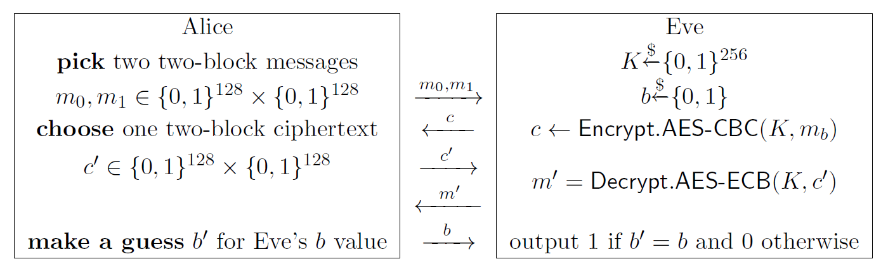

# ECB oracle
Difficulty: 256-bit

The oracle implements the variation of the IND-CPA security game below:



Alice wins if Eve outputs 1. Your task is to find and perform the winning strategy for Alice.

```sh
nc localhost 13371
```

[chal.py](./chal.py)
